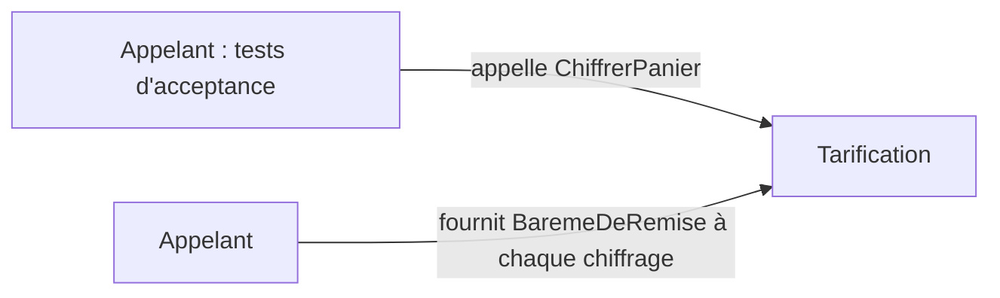

# Context map US-2

## Contextes

| Contexte | Rôle | Classification | Sources |
| --- | --- | --- | --- |
| Tarification | Chiffrer un panier : somme, remises, frais de port, arrondis | Cœur : les règles commerciales (paliers, promotions, gratuité) y changent souvent et se discutent avec le métier | `docs/adr/adr-001-decoupage-domaine-application.md:7-10` |

Il n'existe qu'un seul contexte dans le dépôt : deux projets, `Tarification.Domaine` et `Tarification.Application` (`docs/adr/adr-001-decoupage-domaine-application.md:15-23`). Aucune autre équipe, base ou langage n'est mentionné ; scinder serait du sur-découpage.

Le terme « palier » n'a qu'un sens dans ce contexte : un seuil de quantité de ligne associé à un taux (`stories/US-2.md:7-9`). La portée « toutes références » est une règle métier confirmée (`.skraft/us-2/research/clarifications.md:7`).

## Relations

| Relation | Statut | Justification |
| --- | --- | --- |
| Appelant → Tarification | `CalculDuPanier` est le point d'entrée piloté par les tests d'acceptance | `src/Tarification.Application/CalculDuPanier.cs:15-18` |
| Source du barème → Tarification | L'appelant fournit le barème à chaque chiffrage ; le domaine ne peut pas appeler un service extérieur | `.skraft/us-2/design/clarifications.md:5-8`, `docs/adr/adr-001-decoupage-domaine-application.md:28-30` |

La clarification fixe un apport par l'appelant, pas une intégration avec un autre contexte : aucune couche anticorruption n'est ajoutée pour US-2. Le modèle reçoit directement `BaremeDeRemise` ; aucune traduction de format externe n'est requise par les critères (`.skraft/us-2/design/clarifications.md:5-8`, `.skraft/us-2/design/event-model.md:9`, `stories/US-2.md:7-11`).

## Hors périmètre (ne pas anticiper)

Codes promotionnels et cumul (`stories/US-3.md:14-15`), frais de port et assiette après remises (`stories/US-4.md:7-13`), arrondis (`stories/US-5.md:7-13`) restent dans le même contexte mais dans leurs propres stories. Le catalogue éventuel de l'US-6 pourrait devenir un second contexte (`docs/adr/adr-001-decoupage-domaine-application.md:40-42`) ; rien dans US-2 ne le requiert.
