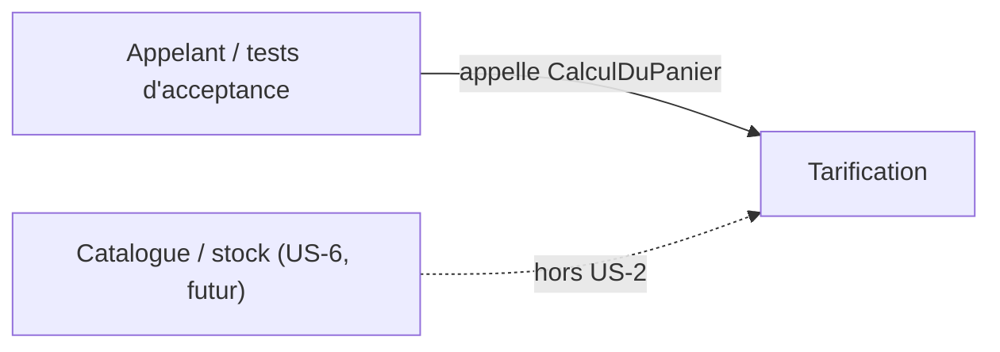

# US-2 — Context map

Sources : `docs/adr/adr-001-decoupage-domaine-application.md:15-21`, `src/Tarification.Application/Tarification.Application.csproj`, `src/Tarification.Domaine/Tarification.Domaine.csproj`, `stories/US-2.md`, `stories/US-6.md:6-14`.

## Contextes

| Contexte | Contenu | Sous-domaine | Source |
| --- | --- | --- | --- |
| `Tarification` | calcul du prix d'un panier : `Montant`, `Quantite`, `LigneDePanier`, `Panier`, paliers de remise, cas d'usage `CalculDuPanier` | Core (règles commerciales qui changent souvent et se discutent avec le métier) | `docs/adr/adr-001-decoupage-domaine-application.md:8-10` |

La liste des contextes est volontairement réduite à un seul : le code ne contient qu'un seul modèle et un seul langage (`Montant`, `Quantite`, `Panier`). La distinction domaine / application est un découpage de couches dans ce contexte, pas deux contextes (`adr-001:15-21`). La classification Core est une lecture du contexte ADR-001 ; aucune autre source ne la confirme.

La remise par palier n'ajoute aucun nouveau contexte : elle utilise les mêmes termes (ligne, quantité, prix unitaire) et la même équipe/déploiement que l'existant (`stories/US-2.md:3-11`).

## Relations

| Relation | Statut | Remarque | Source |
| --- | --- | --- | --- |
| Appelant → `Tarification` | consommation du cas d'usage `CalculDuPanier.Chiffrer` | aucun contexte amont pour US-2 : la grille de paliers est une configuration interne, commune à toutes les références | `src/Tarification.Application/CalculDuPanier.cs:19-21`, `.skraft/us-2/research/clarification.md:7` |
| `Tarification` ↔ Catalogue / stock | **non modélisé** | US-6 le fera peut-être ; ADR-001 prévoit qu'un besoin externe se passe par paramètre et non par appel direct | `adr-001:28-30,40-41`, `stories/US-6.md:6-14` |

Aucune relation ACL, Conformist ou Shared Kernel n'est posée : il n'y a pas de second contexte à relier. À ré-examiner si l'US-6 introduit un catalogue.

## Langage ubiquitaire (contexte `Tarification`)

| Terme | Sens | Source |
| --- | --- | --- |
| Ligne | une référence, une quantité, un prix unitaire | `src/Tarification.Domaine/LigneDePanier.cs:4-6` |
| Palier | couple (seuil de quantité, taux) : « N articles ou plus : X % » | `stories/US-2.md:7` |
| Grille de paliers | l'ensemble des paliers, commun à toutes les références, possiblement vide | `.skraft/us-2/research/clarification.md:7`, `stories/US-2.md:11` |
| Palier atteint | palier dont le seuil ≤ quantité de la ligne | `stories/US-2.md:7-8` |
| Palier retenu | parmi les atteints, celui qui donne la remise maximale ; un seul par ligne | `stories/US-2.md:9` |
| Remise | montant retiré à une ligne ; somme sur le panier = `Facture.Remise` | `src/Tarification.Application/CalculDuPanier.cs:9` |
