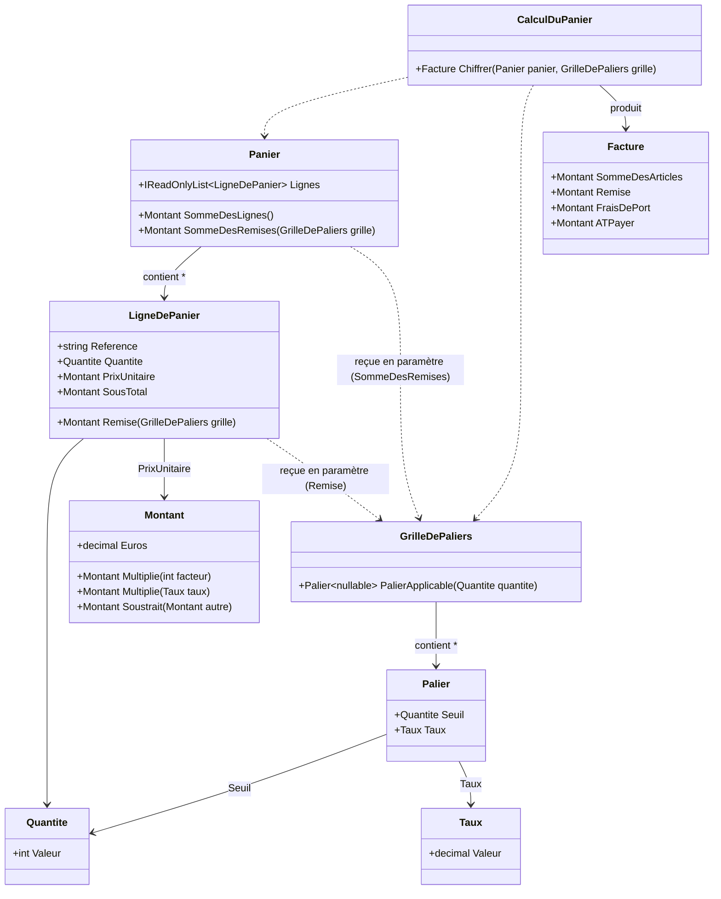
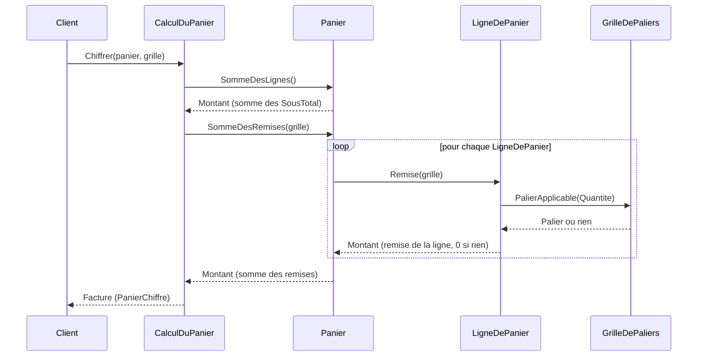
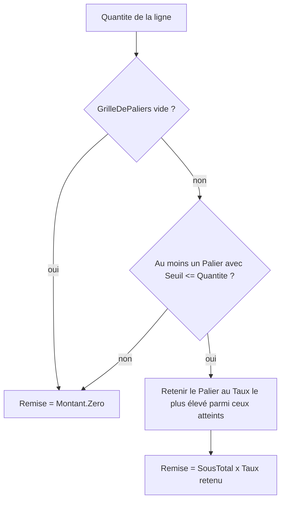

# Diagrammes — US-2 : Remise par palier de quantité

Noms utilisés : uniquement ceux définis dans `domain-model.md` et `event-model.md`.

## Diagramme de classes — nouveaux objets-valeurs et leurs relations

Note : `GrilleDePaliers` n'est jamais stockée sur `LigneDePanier` ni sur `Panier` — c'est un
paramètre transmis à chaque appel, conformément à la réponse utilisateur (grille globale, pas
d'association par référence).

## Séquence — `ChiffrerPanier` (commande unique du modèle d'événements)

Chaque appel `LigneDePanier.Remise(grille)` est indépendant des autres lignes : aucune donnée
partagée entre deux itérations de la boucle, ce qui illustre le critère 4 (pas d'agrégation
inter-lignes avant calcul de remise).

## Flux de décision — sélection du palier applicable

