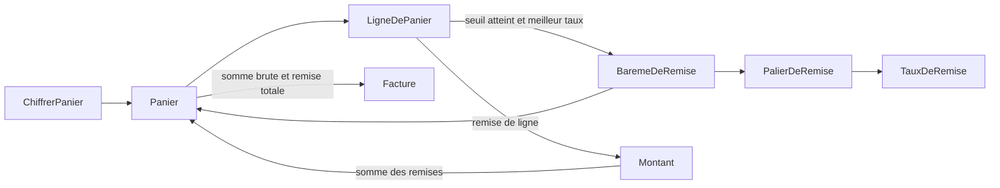
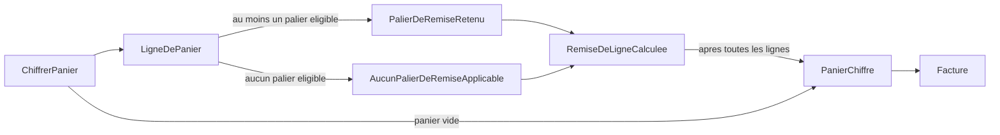

# Diagrammes US-2

## Repartition du calcul

Les fleches representent les donnees et les appels du calcul, pas des couches supplementaires. `ChiffrerPanier` reste le nom de commande du modele, rattache a l'entree existante ; le bareme est fourni a chaque appel (sources : `.skraft/us-2/design/event-model.md:9-11`, `.skraft/us-2/design/clarifications.md:5-8`, `docs/adr/adr-001-decoupage-domaine-application.md:15-30`).

`LigneDePanier` porte son sous-total et sa remise ; `Panier` conserve les lignes et additionne les montants ; `Facture` rend la somme brute, la remise et le montant a payer net (sources : `.skraft/us-2/design/domain-model.md:9,24-26`, `.skraft/us-2/design/event-model.md:20,28-30`, `.skraft/us-2/design/clarifications.md:10-13`).

## Faits par ligne et restitution

Le choix entre les deux premiers faits est exclusif pour chaque ligne. Les faits sont des etapes du modele, sans classes d'evenements obligatoires, publication ni stockage ; une `Facture` est rendue a la fin de l'appel (sources : `.skraft/us-2/design/event-model.md:3,17-22,28`, `docs/adr/adr-001-decoupage-domaine-application.md:40-42`).

Un `Panier` vide ne produit aucun fait de ligne et donne une `Facture` de montants nuls. Une configuration invalide est rejetee avant ce flux ; elle ne devient jamais `AucunPalierDeRemiseApplicable`. Un palier eligible a taux nul passe par `PalierDeRemiseRetenu` (sources : `src/Tarification.Domaine/Panier.cs:16`, `tests/Tarification.Tests/CalculDuPanierTests.cs:33-35`, `.skraft/us-2/design/clarifications.md:15-18`, `.skraft/us-2/design/event-model.md:17-23`).
