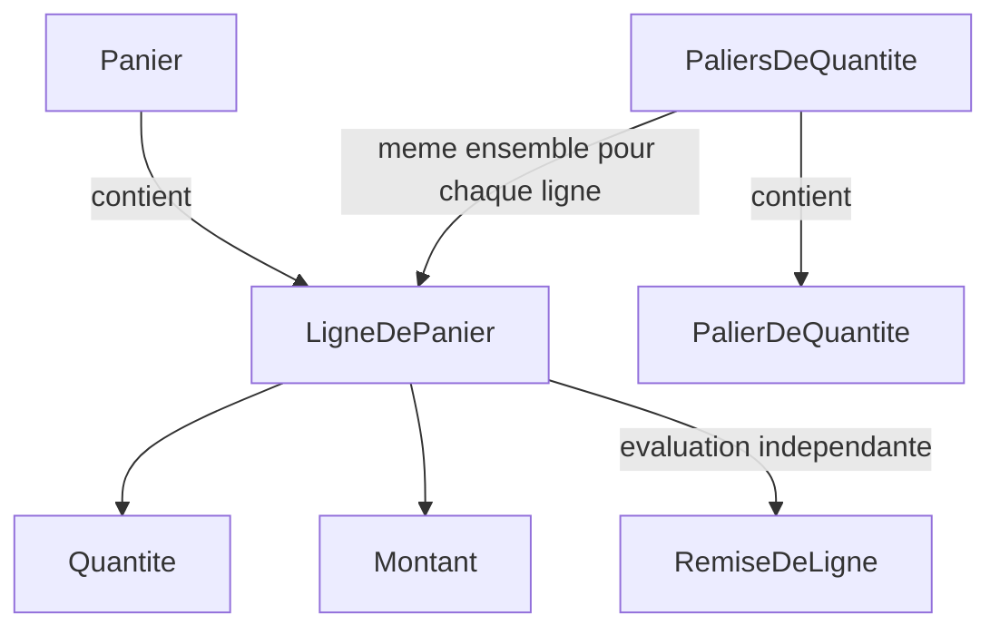
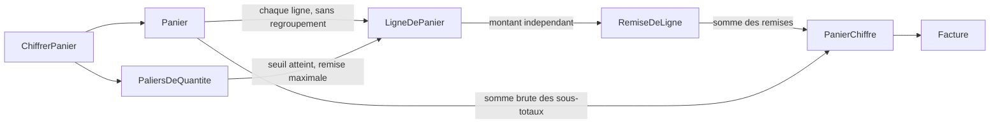

# US-2 - Diagrammes

## Donnees du chiffrage



Le diagramme exprime la composition existante du panier et les valeurs du modele, non des frontieres de persistance. La fleche des paliers vers la ligne represente une donnee de calcul, pas une nouvelle association stockee sur chaque ligne. Sources : `.skraft/us-2/design/domain-model.md:11-16,22-26,38` ; `.skraft/us-2/design/event-model.md:27,30`.

## Flux de calcul



Les noeuds de commande, de fait et de vue sont les noms logiques du modele ; le flux reste un calcul direct en memoire, sans emission ni conservation d'evenement. Sources : `.skraft/us-2/design/event-model.md:7,25-28,34` ; `.skraft/us-2/design/domain-model.md:47,51`.

Les paliers sont selectionnes independamment par ligne ; la somme porte uniquement sur les montants deja calcules. La somme brute reste distincte de la remise. Sources : `.skraft/us-2/design/domain-model.md:34-41` ; `.skraft/us-2/design/event-model.md:28`.

## Resultat observable

```text
`Facture`
  SommeDesArticles = somme brute des sous-totaux
  Remise           = somme des `RemiseDeLigne`
  FraisDePort      = zero pour US-2
  ATPayer          = SommeDesArticles - Remise + FraisDePort
```

Sources : `.skraft/us-2/design/domain-model.md:39,60` ; `src/Tarification.Application/CalculDuPanier.cs:5-13,22` ; `stories/US-3.md:11` ; `stories/US-4.md:7-10`. La formule nette est la cible de conception ; la formule actuelle ne deduit pas encore la remise (`src/Tarification.Application/CalculDuPanier.cs:12`).
