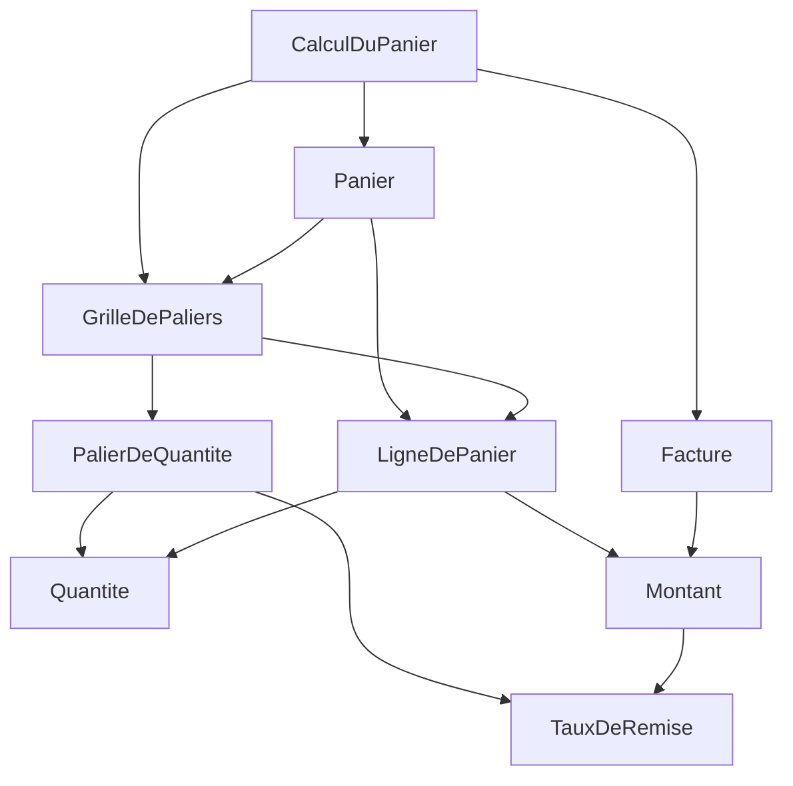
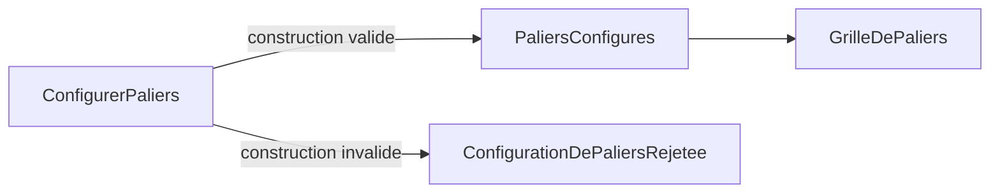
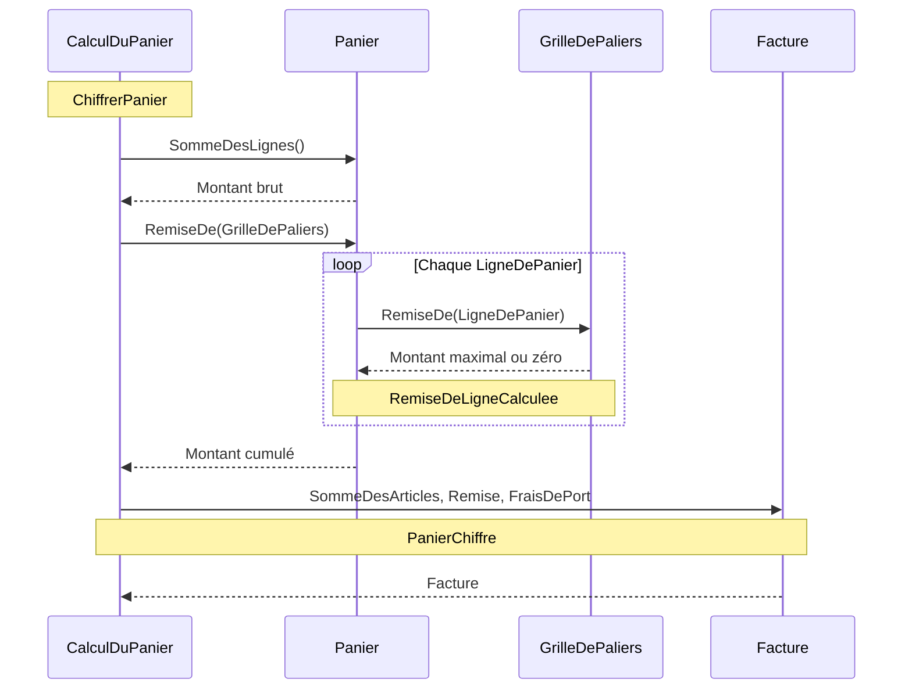

# US-2 — Diagrammes

## Dépendances et responsabilités

Diagramme cible : le cas d'usage dépend du domaine ; `GrilleDePaliers` sélectionne la remise par ligne, `Panier` la cumule, et `Facture` expose le résultat. Sources : `docs/adr/adr-001-decoupage-domaine-application.md:15-21`, `.skraft/us-2/design/domain-model.md:15-32`, `src/Tarification.Application/CalculDuPanier.cs:9-21`.

Les flèches indiquent l'utilisation dans le calcul, pas des dépendances de projets supplémentaires ; notamment le taux intervient dans le calcul d'un montant. Sources : `.skraft/us-2/design/contracts.md:25-28`, `docs/adr/adr-001-decoupage-domaine-application.md:15-21`.

## Configuration et rejet

Les noeuds représentent les commandes, faits et vues du modèle, pas un bus d'événements. Une configuration invalide termine la construction par un rejet explicite. Sources : `.skraft/us-2/design/event-model.md:9-26,30-35`, `.skraft/us-2/research/clarification.md:15`.

## Chiffrage par ligne

Séquence cible de `ChiffrerPanier` : passage explicite de la grille, évaluation indépendante des lignes, somme brute conservée et facture avec remise. Sources : `.skraft/us-2/design/event-model.md:12-14,22-25`, `.skraft/us-2/design/domain-model.md:19,26,46`, `.skraft/us-2/design/contracts.md:25-26,38-43`.

Un panier vide ne parcourt aucune ligne et produit une facture à zéro ; l'appel historique utilise une grille vide. Sources : `tests/Tarification.Tests/CalculDuPanierTests.cs:31-35`, `.skraft/us-2/design/event-model.md:43`, `.skraft/us-2/design/contracts.md:26,38-43`.
